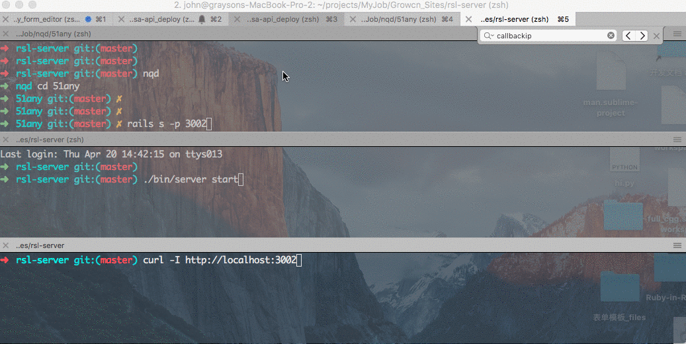

# Rsl::Server

Welcome to your new gem! In this directory, you'll find the files you need to be able to package up your Ruby library into a gem. Put your Ruby code in the file `lib/rsl/server`. To experiment with that code, run `bin/console` for an interactive prompt.

TODO: Delete this and the text above, and describe your gem

## Installation

Add this line to your application's Gemfile:

```ruby
gem 'rsl-server'
```

And then execute:

    $ bundle

Or install it yourself as:

    $ gem install rsl-server

## Usage

## Client

Gemfile

```
gem 'remote_syslog_logger'

```

vim config/application.rb

```
    config.logger = RemoteSyslogLogger.new('localhost',
                                           41346,
                                           program: "qiangda-#{Rails.env}")

```

## Server

### DB

```
psql -c 'create database rsl_server;'
vim .env

```

```
cp .env.example .env
rake db:migrate
```

### start server
```
./bin/server start
```

### Demo



TODO: Write usage instructions here

## Development

After checking out the repo, run `bin/setup` to install dependencies. You can also run `bin/console` for an interactive prompt that will allow you to experiment.

To install this gem onto your local machine, run `bundle exec rake install`. To release a new version, update the version number in `version.rb`, and then run `bundle exec rake release`, which will create a git tag for the version, push git commits and tags, and push the `.gem` file to [rubygems.org](https://rubygems.org).

## Contributing

Bug reports and pull requests are welcome on GitHub at https://github.com/graysonchen/rsl-server.

